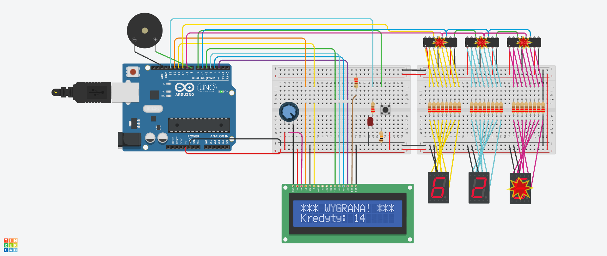

# 🎰 Arduino Slot Machine

A simple slot machine built with Arduino Uno, simulated in TinkerCAD.

## How it works

Press the **SPIN** button to spin three reels, shown on three 7-segment displays (driven via 74HC595 shift registers). After the spin animation, the result is checked:

- Three matching digits (all 6s) → jackpot
- Three matching digits → big win
- Two matching digits → small win
- No match → lose a credit

Credits and game status are shown on a 16x2 LCD. A win triggers an LED and a buzzer.

## Components

- Arduino Uno
- 3x 74HC595 shift register
- 3x 7-segment display (common cathode)
- 16x2 LCD + potentiometer
- Pushbutton, LED, buzzer
- Resistors (220Ω)
